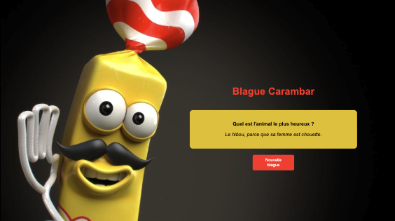

# CaramFront
Carambar & Co - Frontend by Mattheus 
Ce dépôt contient la partie frontend de l’application Carambar & Co by Mattheus réalisé pour un projet de sélection, un site web simple qui affiche des blagues aléatoires issues d’une API backend déployée.

Fonctionnalités
Affiche une blague aléatoire récupérée depuis l’API backend

Interface légère

Technologie : HTML, CSS, JavaScript vanilla

Hébergé sur GitHub Pages pour un accès facile et rapide

Utilisation
L’application appelle l’API backend (déployée sur Render avec une documentation Swagger) pour récupérer les blagues via l’endpoint /api/blagues/random.

